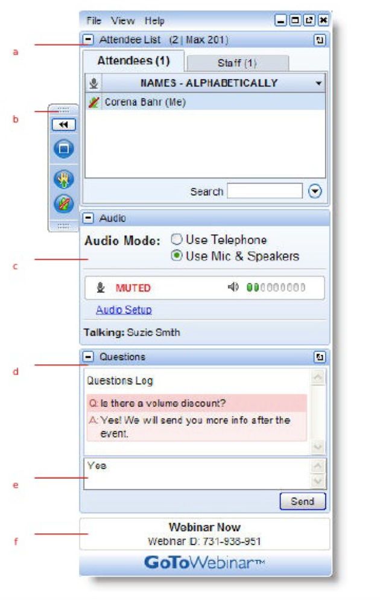

<!--
notes

make sure to advance slides!

the spectrum
  1. hardcoded app in space - python app

  2. configurable app embedded in page - locator web app builder
    developer demo is pointing it at a different webmap

  3 hub ready app
    my street?
    refer to survey123, WAB,

    https://mystreet.surge.sh/

notes from dry run #2

story time is good!
what could we use for slide content? picture of floppy disk?
i like the transition from open data to Hub

sandwich
tell em what youre gonna tell em
tell em
tell em what you told em
-->

<!-- .slide: data-background="../fresher-template/images/2017-slide3.png"-->

# ***ArcGIS* Hub** for GeoDevs

John ([@geogangster](@https://twitter.com/geogangster)) <br>Patrick ([@hamhandedly](https://twitter.com/hamhandedly))


slides: [`http://bit.ly/2AOXtk8`](http://bit.ly/2AOXtk8)

---

<!-- .slide: data-background="../fresher-template/images/2017-slide3.png"-->



---

<!-- .slide: data-background="../fresher-template/images/2017-slide3.png"-->

## Agenda

1. What _is_ Hub?
2. How you can customize it
3. How citizens can program against it
4. How we can **all** collaborate
 * within a city
 * across the :earth_americas:

<small>[`http://bit.ly/2jgH0h5`](http://bit.ly/2jgH0h5)</small>

<!--
john:
product introduction to set context
focusing on extensibility points
something for folks with different skill levels
stuff for folks that work in government
stuff for civic transparency nerds

lots of demos and external links, we'll share urls at the end

ideal: emphasis on civic tech outsiders collaborating with gov
-->

---

<!-- .slide: data-background="../fresher-template/images/2017-slide2.png" -->

## first, _why_ **ArcGIS Hub**?

Story time!


<small>[`http://bit.ly/2jgH0h5`](http://bit.ly/2jgH0h5)</small>

<!--
  patrick:

  before we talk about what Hub is, what is Open Data?

  before there was Open Data, gov operations were opaque
  ArcGIS Open Data sought to bridge the gap between operations and the public
  It has always been included with ArcGIS Online
  Open Data is now a capability of Hub that is included in ArcGIS Online subscriptions

-->

---

<!-- .slide: data-background="../fresher-template/images/2017-slide2.png" -->

## Demo

* Open Data >>> Initiatives

<small>[`http://bit.ly/2jgH0h5`](http://bit.ly/2jgH0h5)</small>

<!--
  patrick:
  Exploring open data as a user, two example of users taking this core capability and using it to move beyond transparency
-->

---

<!-- .slide: data-background="../fresher-template/images/2017-slide2.png" -->


## So...why _Hub_?

* Open Data++

<small>[`http://bit.ly/2jgH0h5`](http://bit.ly/2jgH0h5)</small>

<!--
  patrick:
  Hub is brand new!
  Hub seeks to solve problems that Open Data on its own doesn't
  Hub has addtional capabilities that cost $
    Initiatives
    Community
  Open Data underpins Hub
  Goal: make operationalizing Open Data easier
  Goal: Broaden the scope of engagement beyond computer folk
  Goal: break down silos between departments
  Goal: Measure success (and catch failure early)
-->

---

<!-- .slide: data-background="../fresher-template/images/2017-slide2.png" -->

## ArcGIS Hub

* Data + Initiatives + Community

<small>[`http://bit.ly/2jgH0h5`](http://bit.ly/2jgH0h5)</small>

<!--
  john
  recap patricks talking points above
-->

---

<!-- .slide: data-background="../fresher-template/images/2017-slide2.png" -->

## Under the hood...

```bash
git clone https://github.com/Esri/cedar.git
```
* Sharing charts across the platform
* New interactive browser chart building experience is coming
* Built on top of D3

<small>[`http://bit.ly/2jgH0h5`](http://bit.ly/2jgH0h5)</small>

<!-- john
  https://esri.github.io/ember-cli-cedar/#/charts/line
  dig into the line chart (both live and JSON)
-->

---

<!-- .slide: data-background="../fresher-template/images/2017-slide2.png" -->

* Better support for multi-series charts
* joining datasets
* better default styling

<small>[`http://bit.ly/2jgH0h5`](http://bit.ly/2jgH0h5)</small>

<!-- john -->

---

<!-- .slide: data-background="../fresher-template/images/2017-slide2.png" -->

## How do i _turn on_ :bulb: ArcGIS Hub ?

* Demo - creating Initiative pages

<small>[`http://bit.ly/2jgH0h5`](http://bit.ly/2jgH0h5)</small>

<!--

patrick
show spinning up an opioid inititiave
add a preconfigured app to the new page
we're more flexible than ever about what data you give us
-->

---

<!-- .slide: data-background="../fresher-template/images/2017-slide2.png" -->

* bring your own data
* more flexible, automated configuration
* we guide you to citizen engagement
* pages are [customizable](https://hub.arcgis.com/pages/site-customization)

<small>[`http://bit.ly/2jgH0h5`](http://bit.ly/2jgH0h5)</small>

<!--john
  quicker deployment of useful tools
  page design is customizable
  custom apps and OSS can live side by side with what we ship
-->

---

<!-- .slide: data-background="../fresher-template/images/2017-slide2.png" -->

## Demo [dig into an oss configurable app]

* maps loaded dynamically
* use [shared themes](https://blogs.esri.com/esri/arcgis/2017/02/27/introducing-a-new-app-styling-capability-in-arcgis-online/)

<small>[`http://bit.ly/2jgH0h5`](http://bit.ly/2jgH0h5)</small>

<!-- john

show live app eat two app ids / show JSON
https://www.arcgis.com/apps/View/index.html?appid=a0633500540b4d8f878bdbdc479cdcac
https://www.arcgis.com/apps/View/index.html?webmap=158cebd41f5c4005842283b39e84826c
https://www.arcgis.com/sharing/content/items/a0633500540b4d8f878bdbdc479cdcac/data?f=json
https://www.arcgis.com/sharing/content/items/158cebd41f5c4005842283b39e84826c/data?f=json
https://github.com/Esri/configurable-app-examples-4x-js
-->

---

<!-- .slide: data-background="../fresher-template/images/2017-slide2.png" -->

## Demo [community admin tools]

<small>[`http://bit.ly/2jgH0h5`](http://bit.ly/2jgH0h5)</small>

<!-- 

patrick: 
Citizen experience of initiatives
Tools for managing your community: Two way communication + Events

-->

---

<!-- .slide: data-background="../fresher-template/images/2017-slide2.png" -->

## What about citizen coders?

<small>[`http://bit.ly/2jgH0h5`](http://bit.ly/2jgH0h5)</small>

<!-- john -->

---

<!-- .slide: data-background="../fresher-template/images/2017-slide2.png" -->

## ArcGIS API for Python

* no license required
* distributed via Conda
* integrates with your favorite open source packages

<small>[`http://bit.ly/2jgH0h5`](http://bit.ly/2jgH0h5)</small>

<!--

john:
we want to broaden engagement, but we have great tools for devs and data scientists too
cross promote Python API webinar for more info

-->

---

<!-- .slide: data-background="../fresher-template/images/2017-slide2.png" -->

# [Python API Demo]

<small>[`http://bit.ly/2jgH0h5`](http://bit.ly/2jgH0h5)</small>

<!--

john:
analyze bicycle and pedestrian fatalities
jupyter notebook not the only way to run the Python API, but visually compelling
making the analysis reproducible and transparent
notebooks.esri.com to get going quickly

-->

---

<!-- .slide: data-background="../fresher-template/images/2017-slide2.png" -->

# Anonymous _or_ Identified

* citizens can interact with datasets anonymously

* Hub engagement tools allow folks to unlock premium capabilities too

<small>[`http://bit.ly/2jgH0h5`](http://bit.ly/2jgH0h5)</small>

<!--

john:

steer priorities
rally around an initiative
isolate root causes
propose solutions
create counter narratives

volunteer field crews can conduct surveys
run analysis on esri servers
create drivetimes, analyze demographics
publish derived datasets

facebook and google logins are supported

-->

---

<!-- .slide: data-background="../fresher-template/images/2017-slide2.png" -->

## _Way down_ under the hood...

```bash
git clone https://github.com/Esri/arcgis-rest-js.git
```
* Node.js and browser agnostic
* TypeScript / Vanilla JS
* Promise based

<small>[`http://bit.ly/2jgH0h5`](http://bit.ly/2jgH0h5)</small>

<!-- john -->

---

<!-- .slide: data-background="../fresher-template/images/2017-slide2.png" -->

* ArcGIS for Developers (angular)
* ArcGIS Hub (ember)

<small>[`http://bit.ly/2jgH0h5`](http://bit.ly/2jgH0h5)</small>

<!-- john

## History

* geoservices-js
* node-arcgis
* ember-arcgis-*
* lots of one-off projects

very much a work in progress
http://resources.arcgis.com/en/help/arcgis-rest-api/index.html#//02r3000000tq000000
its an extremely extensive API
brave men have gone down this path before

-->

---

<!-- .slide: data-background="../fresher-template/images/2017-slide2.png" -->

## Hub Ready Apps

a continuum.

hardcoded > configurable > _hub ready_

<small>[`http://bit.ly/2jgH0h5`](http://bit.ly/2jgH0h5)</small>

<!--john

all of the above can co-exist

-->

---

<!-- .slide: data-background="../fresher-template/images/2017-slide2.png" -->

* **ArcGIS Content** using Item config and Group Permissions
* **ArcGIS Identity** for authentication and Community
* **Shared Theme** & global navigation for consistent branding and design
* **Durable State** using URL of current view
* **Accessibility** for impaired users following WCAG & a11y
* **Indicator Aware** for Initiative configuration

<!--john-->

---

<!-- .slide: data-background="../fresher-template/images/2017-slide2.png" -->

* **Telemetry** to track usage and performance
* **Data Citations** link back to Data
* **Discussions** for collaboration and feedback
* **Connected Apps** between Hub Initiatives
* **App Switcher** between related Hub apps
* **Global** Profile for saving views and collaboration
* **Versions** for collaborative editing and publishing

<!--john-->

---

<!-- .slide: data-background="../fresher-template/images/2017-slide2.png" -->

## A _Hub Ready_ example/prototype

[MyStreet](https://github.com/Esri/MyStreet/)

<small>[`http://bit.ly/2jgH0h5`](http://bit.ly/2jgH0h5)</small>

<!--john
 be honest about the current state of doc
-->

---

<!-- .slide: data-background="../fresher-template/images/2017-slide2.png" -->

## more lego pieces

* [sonar](https://github.com/Esri/sonar)
* [koop](koopjs.github.io)

<small>[`http://bit.ly/2jgH0h5`](http://bit.ly/2jgH0h5)</small>

<!-- john -->

---

<!-- .slide: data-background="../fresher-template/images/2017-slide2.png" >

## Collaboration between government and the public

* weekend hackathons _don't_ generate business ready apps
* they _can_ improve data literacy and data quality
* they work best when lots of _different_ stakeholders participate

<!--
patrick:
come to jesus moment for gov folks to set expectations about community events
this seems useful to me, but happy to rethink
->

-- -->

<!-- .slide: data-background="../fresher-template/images/2017-slide2.png" -->

## How do i keep up?

* https://hub.arcgis.com/pages/changelog

<small>[`http://bit.ly/2jgH0h5`](http://bit.ly/2jgH0h5)</small>

<!--
john:
practicing what we preach
transparency into release cycle
release cycle is RAPID
-->

---

<!-- .slide: data-background="../fresher-template/images/2017-slide3.png" -->

## resources

Slides: [`http://bit.ly/2jgH0h5`](http://bit.ly/2jgH0h5)

* [Welcome to ArcGIS Hub Blog](https://blogs.esri.com/esri/arcgis/2017/06/27/welcome-to-arcgis-hub/)
* [2017 UC Teaser](https://www.youtube.com/watch?v=7OrvBKEqQiU)
* [Hub Python Tutorials](https://github.com/esridc/Hub-Tutorials/)
* [Python API Documentation](https://developers.arcgis.com/python/)
* [Hosted Jupyter Notebooks](http://notebooks.esri.com/)
* [`arcgis-rest-js` Documentation](http://arcgis-rest-js.surge.sh/)
* [ArcGIS for Developers](https://developers.arcgis.com/labs/)
* [StoryMap accessiblity blog](https://blogs.esri.com/esri/arcgis/2017/12/07/map-journal-accessibility/)
* [Customizing Hub pages](https://hub.arcgis.com/pages/site-customization)
* [ArcGIS REST API doc](http://resources.arcgis.com/en/help/arcgis-rest-api/index.html#//02r3000000tq000000) - new port coming soon
* [Configurable app examples](https://github.com/Esri/configurable-app-examples-4x-js)
* [Ice Age Flooding](https://wadnr.maps.arcgis.com/apps/Cascade/index.html?appid=84ea4016ce124bd9a546c5cbc58f9e29
)
<!-- john self explanatory -->

---

<!-- .slide: data-background="../fresher-template/images/2017-slide2.png" -->

idea, question, issue, or success story?

[@geogangster](https://twitter.com/geogangster) / [@hamhandedly](https://twitter.com/hamhandedly)

Slides: [`http://bit.ly/2AOXtk8`](http://bit.ly/2AOXtk8)

<!--
john:
surveys will go out soon
we have thick skin
let us know what else you'd like to see!
-->

---

<!-- .slide: data-background="../fresher-template/images/2017-end.png" -->
